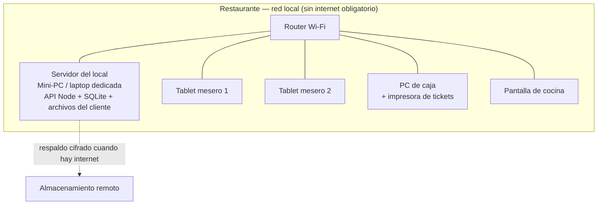
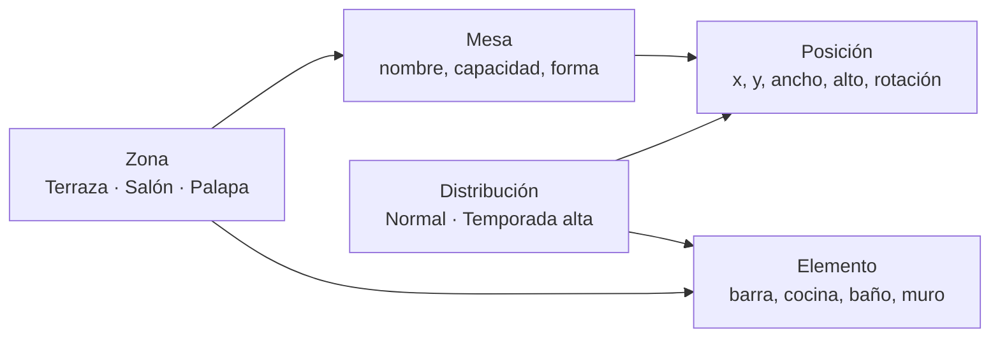

# 03 · Arquitectura

## 1. Stack

Aplicación web moderna, dividida en dos piezas que se despliegan juntas en el propio
restaurante.

| Capa | Tecnología | Por qué |
|---|---|---|
| **API** | Node.js 22 + **Express 5** + TypeScript | Framework mínimo y estable; TypeScript da seguridad sin ceremonia |
| **Base de datos** | **SQLite** (better-sqlite3) con **Drizzle ORM** | Un archivo = respaldo trivial. Sobra para 30 mesas. Drizzle da tipos sin generar código pesado |
| **Migraciones** | SQL versionado + migrador propio (30 líneas) | Cualquiera puede leer el SQL en 5 años; se aplican solas al arrancar |
| **Validación** | **Zod 4** | El servidor nunca confía en lo que manda el navegador |
| **Cliente** | **React 19** + **Vite 8** + TypeScript + React Router 7 | El editor de plano es una interfaz con estado real; React es la herramienta correcta |
| **Estilos** | CSS propio con variables | El POS tiene reglas de diseño concretas (táctil, alto contraste); un framework de UI genérico estorbaría |
| **Pruebas** | `node:test` sobre la capa de servicio | Las reglas de negocio se prueban sin navegador ni servidor |

**Decisión de tamaño:** un monorepo con dos workspaces npm (`server/`, `client/`).
Sin herramientas de monorepo: `npm run dev` levanta ambos.

Detalle y alternativas descartadas en [`adr/0001-stack-tecnologico.md`](adr/0001-stack-tecnologico.md).

---

## 2. Topología de despliegue



**Decisiones clave**

1. **El servidor vive en el local.** Si se cae el internet, el restaurante sigue
   vendiendo. No es negociable en un negocio de piso (RNF-3).
2. **Cero instalación en las tablets.** Abren el navegador en `http://pos.local`.
   Cambiar de tablet no cuesta nada.
3. **En producción, un solo proceso.** Node sirve el API y también los archivos
   estáticos que Vite compiló. Una cosa que arrancar, una cosa que reiniciar.
4. **UPS (no-break) obligatorio** para servidor y router.
5. **El respaldo sale del local** en cuanto hay internet. El riesgo real de un mini-PC
   bajo la barra de un restaurante de mariscos es el agua y el robo.

---

## 3. Estructura del código

```
server/
  migraciones/          SQL numerado, se aplica solo al arrancar
  src/
    config.ts           Configuración con valores por defecto que ya funcionan
    app.ts              Ensamblado de Express
    db/
      esquema.ts        Tablas tipadas (Drizzle)
      cliente.ts        Conexión SQLite + pragmas de durabilidad
      migrar.ts         Migrador propio
      semilla.ts        Usuario administrador inicial
    http/
      errores.ts        ErrorHttp + manejador central
      validar.ts        Puente con Zod
    http/sesion.ts      Sesión por token y permisos por rol
    modulos/
      dinero.ts         Toda la aritmética de dinero, en centavos enteros
      auth/             usuarios, PIN, sesiones, autorizaciones, bitácora
      salon/            zonas, mesas, distribuciones, plano
        salon.esquemas.ts   Contratos de entrada (Zod)
        salon.servicio.ts   Reglas de negocio  ← aquí vive la verdad
        salon.rutas.ts      HTTP delgado
        salon.prueba.ts     Pruebas del servicio
      menu/             categorías, productos, variantes, modificadores
      ordenes/          órdenes, líneas, comandas, cancelaciones
      cuentas/          división, descuentos, propinas, cobro
      caja/             turnos, movimientos, cortes X y Z
      reportes/         consultas agregadas de venta
      config/           datos del negocio, impuestos, estilo del menú

client/
  src/
    api/cliente.ts      Único punto que habla con el API
    estado/Sesion.tsx   Sesión, usuario y configuración vigente
    componentes/
      Lienzo.tsx           Plano interactivo (arrastrar, redimensionar, tocar)
      PanelPropiedades.tsx Edición fina de lo seleccionado
      MenuVenta.tsx        Pantalla de venta, con el estilo que el dueño configuró
      DialogoProducto.tsx  Captura de tamaño, peso, precio del día y modificadores
      PedirAutorizacion.tsx Un solo mecanismo para toda acción sensible
      TecladoNumerico.tsx  Teclado grande para caja y piso
    paginas/
      Ingreso.tsx          Ingreso por PIN
      VistaSalon.tsx       Vista de piso (mesero)
      TomaOrden.tsx        Captura y envío a cocina
      Cobro.tsx            Cuentas, división, descuentos y cobro
      Cocina.tsx           Comandas pendientes
      Caja.tsx             Turno, movimientos y corte
      EditorPlano.tsx      Editor del comedor (administrador)
      AdminMenu.tsx        Catálogo y modificadores
      AdminConfig.tsx      Negocio, impuestos y estilo del menú
      AdminUsuarios.tsx    Equipo y bitácora
      Reportes.tsx         Ventas, productos, meseros, cancelaciones
    hooks/usePlano.ts   Carga del plano
    tipos.ts            Tipos compartidos con el API
```

**Regla de módulos:** cada módulo del negocio (`salon`, y después `menu`, `ordenes`,
`cuentas`, `caja`) tiene los mismos cuatro archivos. Un desarrollador que entienda uno,
entiende todos.

**Regla de capas:** las rutas no deciden nada. Validan, llaman al servicio y responden.
Toda la lógica —y por tanto todo lo que se prueba— vive en el servicio.

---

## 4. El módulo de salón



La idea que sostiene el módulo: **la mesa y su posición son cosas distintas**. La mesa
tiene identidad e historial de ventas; su posición depende de la distribución vigente.
Así el dueño puede tener el comedor "Normal" y el de "Temporada alta" sin duplicar
mesas ni perder el historial de ninguna.

### Contrato HTTP

| Método | Ruta | Qué hace |
|---|---|---|
| `GET` | `/api/salon/plano?layout=1` | Todo el comedor en una sola petición |
| `GET/POST/PATCH/DELETE` | `/api/salon/layouts` | Distribuciones (crear copia una existente) |
| `POST/PATCH/DELETE` | `/api/salon/zonas` | Zonas |
| `POST/PATCH/DELETE` | `/api/salon/mesas` | Mesas (atributos y posición) |
| `POST/PATCH/DELETE` | `/api/salon/elementos` | Referencias visuales |
| `PUT` | `/api/salon/posiciones` | **Guardado por lote** de todo lo que se movió |

`PUT /posiciones` existe porque el editor mueve muchas cosas antes de guardar: mandar
una petición por mesa sería lento y dejaría el comedor a medio guardar si algo falla.
Va en una transacción: queda todo o no queda nada.

---

## 4b. El menú flexible

El módulo `menu` es el que permite que el mismo sistema sirva a restaurantes con menús
muy distintos: cuatro estilos de venta (precio único, tamaños, por peso, precio del día),
modificadores reutilizables entre productos, y un estilo visual de la pantalla de venta
que el dueño configura y previsualiza sin ayuda.

El diseño completo está en [`07-menu-flexible.md`](07-menu-flexible.md).

---

## 5. Decisiones que sostienen la operación

- **Importes en centavos, enteros.** Nunca punto flotante (aplica al módulo de cuentas).
- **El precio se congela en la línea de venta** al enviar a cocina. Si sube el precio del
  camarón a media tarde, las cuentas abiertas no cambian.
- **Idempotencia en dinero y comandas.** Cada envío a cocina y cada cobro lleva una clave
  única generada en la pantalla; si el Wi-Fi hace reintentar, se aplica una sola vez. Es
  la protección real contra la red intermitente de un restaurante.
- **Sin turno de caja abierto no se cobra.** Es la regla que hace que el corte cuadre.
- **Toda acción sensible pide PIN de un rol superior** y queda en la bitácora: cancelar
  algo enviado, descontar, reabrir una cuenta cobrada.
- **Las divisiones de cuenta no pierden centavos.** El reparto proporcional asigna los
  centavos sobrantes por mayor resto, así la suma de las partes es exactamente el total.
- **Nada se borra.** Cancelar es una operación con motivo, autor y hora.
- **`synchronous = FULL` en SQLite.** Cada commit va a disco antes de responder: un corte
  de luz no pierde una comanda ya enviada (RNF-6). Cuesta milisegundos y vale la pena.
- **`journal_mode = WAL`.** Varias tablets leyendo mientras la caja escribe.
- **El servidor calcula, el cliente pinta.** Totales, permisos y validaciones se resuelven
  en el API. Lo que manda el navegador es una propuesta.

---

## 6. Estrategia de interfaz

- **Tres contextos, tres tratamientos** sobre el mismo sistema de diseño:
  **piso** (táctil, botones enormes), **caja** (densidad media, teclado numérico),
  **administración** (formularios y tablas).
- **Objetivos táctiles de 48 px como mínimo** y colores de alto contraste: la terraza
  tiene sol directo.
- **El editor de plano usa Pointer Events**, no ratón: el mismo código funciona con dedo,
  ratón y lápiz. Las figuras llevan `touch-action: none` para que arrastrar no haga
  scroll de la página.
- **Los campos numéricos X/Y/ancho/alto siempre están disponibles** junto al arrastre:
  sirven para alinear con precisión y como respaldo si el arrastre falla en una tablet
  vieja.
- **Pantallas vivas por sondeo ligero** (la vista de salón se refresca sola cada 10 s).
  Cuando la pantalla de cocina lo exija, se cambia a WebSocket; hoy sería complejidad sin
  beneficio.

---

## 7. Seguridad razonable para el tamaño del negocio

| Riesgo | Mitigación |
|---|---|
| Personal que se autoriza descuentos solo | Autorización por PIN de un rol superior + bitácora |
| Robo hormiga de efectivo | Corte por turno con diferencia visible y arqueo obligatorio |
| Pérdida del equipo (agua, robo) | Respaldo diario automático fuera del local |
| Wi-Fi de clientes con acceso al POS | Red separada para el POS, con contraseña distinta |
| Contraseñas débiles | El PIN solo permite operar; la administración pide usuario y contraseña |

No se busca seguridad de banco. Se busca que **nadie mueva dinero sin dejar rastro**.

---

## 8. Lo que deliberadamente NO hacemos

| Tentación | Por qué la rechazamos |
|---|---|
| Microservicios | Un restaurante con 30 mesas es un monolito, y está bien |
| Nube como única sede | Sin internet no habría venta: inaceptable |
| Framework de UI genérico | El POS tiene reglas propias de tamaño y contraste; pesaría más de lo que ayuda |
| ORM con migraciones mágicas | Migraciones en SQL que cualquiera puede leer y revertir |
| Tiempo real por WebSocket desde el día 1 | Sondeo ligero resuelve hoy; se cambia cuando duela |
| Estado global complejo en el cliente | El estado de la mesa vive en la base de datos, no en la tablet |
