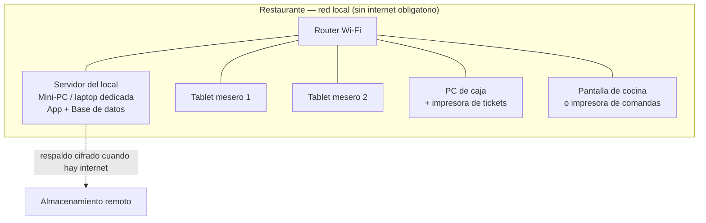
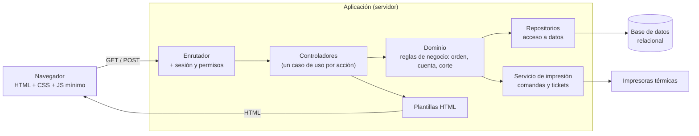

# 03 · Arquitectura

## 0. Qué entendemos por "legacy web"

Este documento asume la siguiente interpretación, y sobre ella está construido todo el
diseño. **Si tu idea de "legacy web" es otra, este es el punto a corregir antes de
escribir código** (ver `adr/0001-stack-tecnologico.md`).

> **Legacy web** = aplicación web clásica: **renderizada en el servidor**,
> **multi-página** (navegación por enlaces y formularios HTML), sin SPA, sin estado
> complejo en el cliente, y capaz de correr en navegadores viejos y hardware modesto.
> El JavaScript es **mejora progresiva**, no requisito.

### Por qué encaja tan bien con este cliente

| Necesidad del restaurante | Lo que aporta el enfoque clásico |
|---|---|
| Tablets baratas y viejas | El trabajo pesado lo hace el servidor; el navegador solo pinta HTML |
| Sin personal técnico | Un solo proceso y una sola base de datos que respaldar |
| Presupuesto bajo | Cero licencias, hosting local o servidor de $50 USD |
| Vida larga del sistema | HTML + formularios no se rompen cuando cambia la moda del frontend |
| Depuración simple | Ver el HTML es ver el estado; no hay que reproducir un estado de cliente |

### La excepción justificada

El **editor de plano del comedor** (RF-1.3) sí necesita JavaScript real: arrastrar
mesas sobre una cuadrícula. Se resuelve con JS propio, sin framework, y con un
**modo alterno por formulario** (capturar coordenadas y tamaño en campos numéricos)
para que la funcionalidad nunca quede bloqueada si el JS falla en un dispositivo viejo.

---

## 1. Topología de despliegue

**Decisiones clave de despliegue**

1. **El servidor vive en el local.** Si se cae el internet, el restaurante sigue
   vendiendo. Esto no es negociable en un negocio de piso (RNF-3).
2. **Cero instalación en las tablets.** Solo abren el navegador en una dirección local
   (`http://pos.local` o una IP fija). Cambiar de tablet no cuesta nada.
3. **El respaldo sale del local** en cuanto hay internet. El riesgo real de un mini-PC
   bajo la barra de un restaurante de mariscos es el agua y el robo, no el hackeo.
4. **UPS (no-break) obligatorio** para el servidor y el router. Cuesta poco y protege
   la operación completa.

---

## 2. Arquitectura de la aplicación

Capas simples, sin ceremonia. Cada petición entra, se resuelve, se responde HTML.

**Reglas de la arquitectura**

- **Un caso de uso = un controlador delgado.** Nada de controladores de 800 líneas.
- **Las reglas de negocio viven en el dominio, no en las plantillas.** El cálculo de la
  cuenta, la validación de un cierre de caja y la autorización de una cancelación se
  prueban sin navegador.
- **POST + redirect después de toda acción que cambia datos.** Evita el doble cobro por
  refrescar la página. Crítico en caja.
- **Idempotencia en operaciones de dinero.** Cada envío de comanda y cada cobro lleva
  un identificador único generado en la pantalla; si llega dos veces, se aplica una vez.
  Es la protección real contra el Wi-Fi intermitente de un restaurante.
- **Sin estado en el cliente.** El estado de la mesa vive en la base de datos, no en la
  tablet. Si la tablet se muere, otro mesero abre la misma mesa desde otra y sigue.

---

## 3. Módulos

| Módulo | Responsabilidad | Depende de |
|---|---|---|
| `auth` | Ingreso por PIN, sesión, roles, autorizaciones puntuales | — |
| `salon` | Zonas, mesas, plano, estados, unión de mesas | `auth` |
| `menu` | Categorías, productos, variantes, modificadores, disponibilidad | `auth` |
| `ordenes` | Orden, líneas, comandas, cancelaciones | `salon`, `menu` |
| `cuentas` | Cuenta, división, descuentos, propinas, cobro | `ordenes` |
| `caja` | Turnos, movimientos de efectivo, cortes X/Z | `cuentas` |
| `reportes` | Consultas agregadas de venta | `cuentas`, `caja` |
| `impresion` | Formato y envío a impresoras térmicas | `ordenes`, `cuentas` |
| `config` | Datos del negocio, impuestos, impresoras, respaldos | `auth` |
| `bitacora` | Registro inmutable de acciones sensibles | todos |

---

## 4. Estrategia de frontend

- **HTML semántico + CSS propio.** Sin framework de UI. Una hoja de estilos con
  variables de color y tamaños grandes para uso táctil.
- **Tres "pieles" según el rol**, porque los contextos de uso son distintos:
  - **Piso (mesero):** táctil, botones enormes, pocas opciones por pantalla.
  - **Caja:** densidad media, atajos de teclado, teclado numérico grande.
  - **Administración:** tablas y formularios normales, uso con mouse.
- **JS solo donde paga su costo:** editor de plano, teclado numérico de cobro,
  autoactualización de la pantalla de cocina.
- **Actualización de pantallas vivas** (plano del comedor, pantalla de cocina) por
  recarga ligera periódica: pide solo el fragmento que cambió, cada pocos segundos. Sin
  WebSockets en la primera versión — menos piezas que fallen.

---

## 5. Datos y consistencia

- Base de datos **relacional** con transacciones. Cobrar una cuenta y cerrar la mesa es
  una transacción, o no es nada.
- **Los importes se guardan en centavos, en enteros.** Nunca en punto flotante.
- **La línea de venta congela el precio** al momento de enviarla a cocina. Si el dueño
  sube el precio del camarón a media tarde, las cuentas abiertas no cambian.
- **Nada se borra.** Cancelar es una operación con motivo, autor y timestamp.

---

## 6. Seguridad razonable para el tamaño del negocio

| Riesgo | Mitigación |
|---|---|
| Personal que se autoriza descuentos solos | Autorización por PIN de un rol superior + bitácora |
| Robo hormiga de efectivo | Corte por turno con diferencia visible y arqueo obligatorio |
| Pérdida del equipo (agua, robo) | Respaldo diario automático fuera del local |
| Alguien en el Wi-Fi de clientes accediendo al POS | Red Wi-Fi separada para el POS, con contraseña distinta a la de clientes |
| Contraseñas débiles | PIN solo permite operar; la administración requiere usuario y contraseña real |

No se busca seguridad de banco. Se busca que **nadie pueda mover dinero sin dejar
rastro**.

---

## 7. Lo que deliberadamente NO hacemos

| Tentación | Por qué la rechazamos |
|---|---|
| SPA con framework moderno | Rompe RNF-1 y RNF-2, y agrega un build que nadie mantendrá |
| Microservicios | Un restaurante con 30 mesas es un monolito, y está bien |
| Nube como única sede | Sin internet no habría venta; inaceptable |
| ORM pesado con migraciones mágicas | Consultas explícitas y migraciones SQL versionadas |
| Tiempo real por WebSocket desde el día 1 | Complejidad alta, valor bajo frente a recarga periódica |
