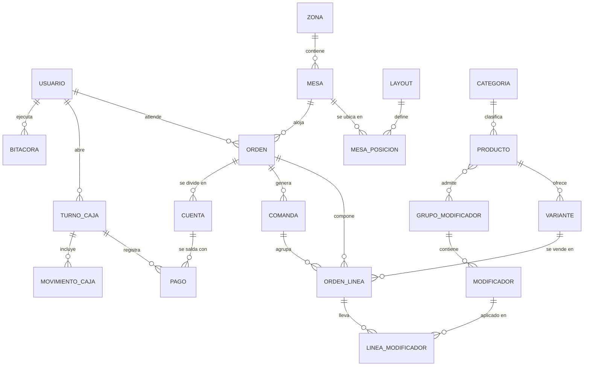

# 04 · Modelo de datos

Modelo relacional. Todos los importes en **centavos (enteros)**. Todas las fechas en
zona `America/Mazatlan`.

## Diagrama entidad-relación

## Tablas

### Comedor

**`zona`** — `id`, `nombre`, `orden`, `activa`

**`mesa`** — `id`, `zona_id`, `nombre` (ej. "T-4"), `capacidad`, `forma`
(`redonda|cuadrada|rect|barra`), `activa`, `estado`
(`libre|ocupada|cuenta_pedida|por_limpiar|reservada`)

**`layout`** — `id`, `nombre` ("Normal", "Temporada alta"), `activo`
> Permite guardar varias distribuciones del comedor (RF-1.8) sin duplicar las mesas.

**`mesa_posicion`** — `layout_id`, `mesa_id`, `x`, `y`, `ancho`, `alto`, `rotacion`
> La posición depende del layout, no de la mesa. Cambiar de distribución es cambiar un
> renglón de configuración, no rehacer el comedor.

**`elemento_plano`** — `id`, `layout_id`, `tipo` (`barra|cocina|baño|muro|planta|texto`),
`etiqueta`, `x`, `y`, `ancho`, `alto`
> Referencias visuales no vendibles para que el mesero se ubique (RF-1.9).

### Menú

**`categoria`** — `id`, `nombre`, `orden`, `activa`

**`producto`** — `id`, `categoria_id`, `nombre`, `descripcion`, `estacion`
(`cocina|barra`), `precio_abierto` (bool, para "precio del día"), `activo`,
`disponible_hoy` (bool)

**`variante`** — `id`, `producto_id`, `nombre` ("Orden", "Media orden", "Chico"),
`precio_centavos`, `orden`, `activa`
> Todo producto tiene al menos una variante. Uniformar esto evita dos rutas de precio.

**`grupo_modificador`** — `id`, `nombre` ("Término", "Extras"), `min_selecciones`,
`max_selecciones`

**`modificador`** — `id`, `grupo_id`, `nombre`, `precio_extra_centavos`

**`producto_grupo_modificador`** — `producto_id`, `grupo_id`

### Operación

**`orden`** — `id`, `folio`, `mesa_id`, `mesero_id`, `comensales`, `estado`
(`abierta|cobrada|cancelada`), `abierta_en`, `cerrada_en`, `orden_padre_id`
> `orden_padre_id` resuelve la unión de mesas (RF-1.7): dos mesas comparten una orden.

**`orden_linea`** — `id`, `orden_id`, `comanda_id`, `variante_id`,
`producto_nombre_snapshot`, `variante_nombre_snapshot`, `precio_unitario_centavos`,
`cantidad`, `nota`, `estado` (`pendiente|enviada|lista|servida|cancelada`),
`motivo_cancelacion`, `cancelada_por_id`, `es_cortesia`
> Los campos `*_snapshot` y el precio congelado hacen que el ticket de hace tres meses
> siga siendo verdad aunque el producto ya no exista.

**`linea_modificador`** — `linea_id`, `modificador_id`, `nombre_snapshot`,
`precio_extra_centavos`

**`comanda`** — `id`, `orden_id`, `estacion`, `enviada_en`, `lista_en`,
`clave_idempotencia`
> `clave_idempotencia` evita la comanda duplicada cuando el Wi-Fi hace reintentar.

### Dinero

**`cuenta`** — `id`, `orden_id`, `nombre` ("Cuenta 1", "Juan"), `subtotal_centavos`,
`descuento_centavos`, `motivo_descuento`, `autorizado_por_id`, `impuesto_centavos`,
`propina_centavos`, `total_centavos`, `estado` (`abierta|cobrada|cancelada`),
`cerrada_en`, `turno_id`

**`cuenta_linea`** — `cuenta_id`, `linea_id`, `proporcion`
> Con `proporcion` se puede partir un platillo entre dos cuentas (la botana que
> compartieron) sin inventar líneas falsas.

**`pago`** — `id`, `cuenta_id`, `turno_id`, `metodo` (`efectivo|tarjeta|transferencia`),
`monto_centavos`, `referencia`, `recibido_centavos`, `cambio_centavos`, `creado_en`,
`clave_idempotencia`
> Varios pagos por cuenta = pago mixto (RF-4.5), sin tabla extra.

**`turno_caja`** — `id`, `usuario_id`, `abierto_en`, `fondo_inicial_centavos`,
`cerrado_en`, `declarado_efectivo_centavos`, `esperado_efectivo_centavos`,
`diferencia_centavos`, `estado`

**`movimiento_caja`** — `id`, `turno_id`, `tipo` (`entrada|retiro|gasto|propina_pagada`),
`monto_centavos`, `concepto`, `usuario_id`, `creado_en`

### Sistema

**`usuario`** — `id`, `nombre`, `rol` (`admin|cajero|mesero|cocina`), `pin_hash`,
`password_hash` (solo admin), `activo`
> Baja lógica: nunca se borra un usuario con ventas asociadas (RF-7.6).

**`bitacora`** — `id`, `usuario_id`, `accion`, `entidad`, `entidad_id`, `detalle_json`,
`creado_en`
> Solo inserciones. Nunca se actualiza ni se borra.

**`config`** — `clave`, `valor`
> Nombre del negocio, dirección, tasa de impuesto, precios con impuesto incluido,
> impresoras por estación.

## Reglas de negocio que el modelo debe garantizar

1. Una mesa activa no puede tener dos órdenes `abierta` al mismo tiempo.
2. Una línea `enviada` no se edita: se cancela con motivo y se crea otra.
3. Una cuenta no se puede cobrar si su turno de caja está cerrado.
4. La suma de los pagos de una cuenta cobrada es exactamente su total.
5. Cerrar la última cuenta de una orden cierra la orden y deja la mesa `por_limpiar`.
6. `total = subtotal - descuento + impuesto + propina`, calculado siempre en el
   servidor. Lo que mande el navegador es una sugerencia, no una verdad.
