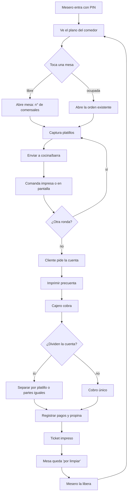
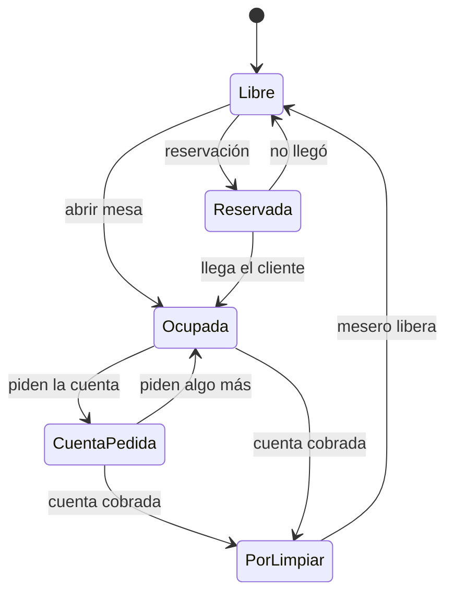
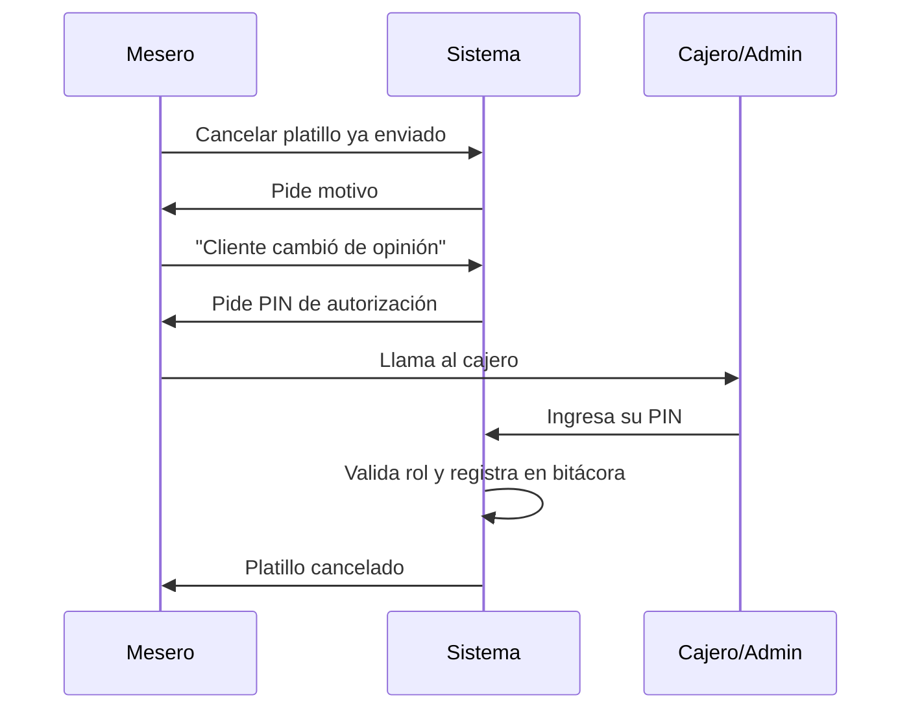

# 05 · Flujos y bocetos de pantalla

## 0. Dónde empieza el mesero

El flujo diario del mesero **no pasa por el plano del comedor**. El mesero conoce su
salón de memoria; lo que no puede saber de un vistazo es qué mesa lleva 40 minutos
esperando o cuál ya tiene comida lista en la barra. Por eso entra a **“Mis mesas”**:
una lista ordenada por urgencia, pensada para un teléfono y para el pulgar.

```
┌─────────────────────────────────┐
│ Mis mesas   1 en servicio       │
├─────────────────────────────────┤
│ ▍T-2  Listo para servir · 2     │
│       Terraza · 4p · 18 min     │
│                        $410.00  │
│       [ Cuenta ]                │
├─────────────────────────────────┤
│ ▍T-5  Falta enviar a cocina · 3 │
│       Terraza · 2p · 4 min      │
│                        $180.00  │
├─────────────────────────────────┤
│ ▍S-1  Por limpiar               │
│       [ Marcar limpia ]         │
├─────────────────────────────────┤
│        [ + Abrir mesa ]         │  ← zona del pulgar
└─────────────────────────────────┘
```

El color del borde dice qué reclama atención antes de leer una palabra. El plano
sigue existiendo en dos formas: el **editor** (escritorio, solo el dueño) y una
**vista de consulta** a la que se llega desde aquí cuando de verdad hace falta.

## 1. Flujo principal del servicio



## 2. Ciclo de vida de una mesa



## 3. Bocetos

Los bocetos son de **estructura y jerarquía**, no de estética. Lo importante es qué se
ve primero y qué tan grande es lo que se toca.

### 3.1 Plano del comedor — vista mesero (tablet horizontal)

```
┌───────────────────────────────────────────────────────────────────┐
│  MARISCOS MAZATLÁN          Mesero: Luis      12:40 pm    [Salir] │
├───────────────────────────────────────────────────────────────────┤
│  [ TERRAZA ]   [ SALÓN ]   [ PALAPA ]   [ BARRA ]                 │
├───────────────────────────────────────────────────────────────────┤
│                                                                   │
│    ┌──────┐      ┌──────┐        ╭────────╮       ┌──────┐        │
│    │ T-1  │      │ T-2  │        │  T-3   │       │ T-4  │        │
│    │  4p  │      │  4p  │        │   6p   │       │  2p  │        │
│    │LIBRE │      │$1,240│        │ LIBRE  │       │$380  │        │
│    │      │      │ 0:35 │        │        │       │ 1:10 │        │
│    └──────┘      └──────┘        ╰────────╯       └──────┘        │
│                                                                   │
│    ┌──────┐      ┌──────┐        ┌──────────────┐                 │
│    │ T-5  │      │ T-6  │        │     BARRA    │                 │
│    │  4p  │      │  4p  │        │  B1 B2 B3 B4 │                 │
│    │ $890 │      │LIMPIAR│       │  ·  $210 ·  ·│                 │
│    │ CTA  │      │      │        └──────────────┘                 │
│    └──────┘      └──────┘                                         │
│                                                                   │
├───────────────────────────────────────────────────────────────────┤
│  Libre ▢   Ocupada ▨   Cuenta pedida ▩   Por limpiar ▤            │
└───────────────────────────────────────────────────────────────────┘
```

**Decisiones de diseño**
- La mesa muestra **tres datos y ya**: consumo, tiempo transcurrido y estado. El tiempo
  es la información que un mesero de mariscos usa más: le dice a quién atender.
- El color hace el trabajo, no el texto. Se aprende en un turno.
- Cambiar de zona son pestañas grandes, no un menú desplegable.

### 3.2 Editor de plano — vista administrador

```
┌────────────────────────────────────────────────────────────────────┐
│  Editar comedor    Distribución: [ Normal  ▾ ]   [Guardar cambios] │
├──────────────┬─────────────────────────────────────────────────────┤
│ AGREGAR      │                                                     │
│              │   · · · · · · · · · · · · · · · · · · · · · · · ·   │
│ [+ Mesa 2p]  │   · ┌──────┐ · · ┌──────┐ · · · · · ╭────────╮ · ·  │
│ [+ Mesa 4p]  │   · │ T-1  │ · · │ T-2  │ · · · · · │  T-3   │ · ·  │
│ [+ Mesa 6p]  │   · └──────┘ · · └──────┘ · · · · · ╰────────╯ · ·  │
│ [+ Barra]    │   · · · · · · · · · · · · · · · · · · · · · · · ·   │
│ [+ Muro]     │   · ┌──────┐ · · ┌══════┐◄── seleccionada · · · ·   │
│ [+ Texto]    │   · │ T-5  │ · · ║ T-6  ║ · · · · · · · · · · · ·   │
│              │   · └──────┘ · · └══════┘ · · · · · · · · · · · ·   │
│ ──────────── │   · · · · · · · · · · · · · · · · · · · · · · · ·   │
│ MESA T-6     │                                                     │
│ Nombre [T-6] │   Arrastra para mover. La cuadrícula alinea sola.   │
│ Cap.   [ 4 ] │                                                     │
│ Forma  [▭ ▾] │   Sin ratón: usa los campos X / Y de la izquierda.  │
│ X [120] Y[80]│                                                     │
│ [Duplicar]   │                                                     │
│ [Desactivar] │                                                     │
└──────────────┴─────────────────────────────────────────────────────┘
```

**Decisiones de diseño**
- Los campos **X / Y numéricos** existen siempre: son el respaldo si el arrastre falla
  en una tablet vieja, y el modo preciso para alinear.
- **Duplicar mesa** es el botón más usado al montar el comedor por primera vez.
- **Desactivar, no borrar**: una mesa con historial de ventas nunca se elimina.

### 3.3 Toma de orden

```
┌───────────────────────────────────────────────────────────────────┐
│ ◀ Plano      MESA T-2 · 4 personas · Luis · 0:35    [Enviar ▶]    │
├──────────────────────────────────┬────────────────────────────────┤
│ Botanas │ Cocteles │ Filetes │ + │  ORDEN                         │
├──────────────────────────────────┤                                │
│                                  │  2  Coctel camarón   $  360.00 │
│  ┌────────────┐ ┌────────────┐   │     · grande                   │
│  │  Coctel    │ │  Coctel    │   │  1  Aguachile        $  195.00 │
│  │  camarón   │ │  campechana│   │     · sin cebolla              │
│  │   $180     │ │   $210     │   │  3  Cerveza clara    $  135.00 │
│  └────────────┘ └────────────┘   │  ─────────────────────────────  │
│  ┌────────────┐ ┌────────────┐   │  Enviado a cocina (12:05)      │
│  │ Aguachile  │ │  Ceviche   │   │  1  Orden de tacos   $   95.00 │
│  │   $195     │ │  AGOTADO   │   │  ─────────────────────────────  │
│  └────────────┘ └────────────┘   │  TOTAL               $  785.00 │
│                                  │                                │
│                                  │  [Precuenta]  [Cancelar línea] │
└──────────────────────────────────┴────────────────────────────────┘
```

**Decisiones de diseño**
- Producto agotado se ve, pero no se puede tocar. Ocultarlo hace que el mesero lo busque
  y pierda tiempo.
- Lo ya enviado se separa visualmente de lo que sigue en captura: es lo que evita el
  error de "creí que ya lo había mandado".
- **Enviar** está arriba a la derecha, siempre en el mismo lugar, siempre grande.

### 3.4 Cobro

```
┌───────────────────────────────────────────────────────────────────┐
│ MESA T-2 · Cuenta 1 de 1                        Total: $785.00    │
├───────────────────────────────────────────────────────────────────┤
│  MÉTODO                          │  ┌─────┬─────┬─────┐           │
│  [●] Efectivo                    │  │  1  │  2  │  3  │           │
│  [ ] Tarjeta                     │  ├─────┼─────┼─────┤           │
│  [ ] Transferencia               │  │  4  │  5  │  6  │           │
│  [ ] Pago mixto                  │  ├─────┼─────┼─────┤           │
│                                  │  │  7  │  8  │  9  │           │
│  Recibido:  $ 1000.00            │  ├─────┼─────┼─────┤           │
│  ────────────────────────        │  │  0  │ 00  │  ←  │           │
│  CAMBIO:    $  215.00            │  └─────┴─────┴─────┘           │
│                                  │                                │
│  Propina:  [ 10% ][ 15% ][ otro ]│  [$200] [$500] [$1000] [Exacto]│
├───────────────────────────────────────────────────────────────────┤
│  [ Dividir cuenta ]  [ Descuento ]        [ COBRAR E IMPRIMIR ]   │
└───────────────────────────────────────────────────────────────────┘
```

**Decisiones de diseño**
- El **cambio en grande** es lo único que importa en ese momento.
- Botones de billetes comunes: quita el 80% de la digitación real.
- Descuento y división están presentes, pero no compiten con la acción principal.

### 3.5 Pantalla de cocina

```
┌───────────────────────────────────────────────────────────────────┐
│  COCINA · 3 comandas pendientes                        12:41 pm   │
├────────────────────┬────────────────────┬─────────────────────────┤
│ T-2  ·  4 min      │ T-5  ·  9 min      │ T-4  ·  14 min  ⚠       │
│ ─────────────────  │ ─────────────────  │ ─────────────────       │
│ 2  Coctel camarón  │ 1  Filete empanizad│ 1  Mojarra frita        │
│    grande          │ 2  Arroz           │ 1  Camarones al mojo    │
│ 1  Aguachile       │                    │    · sin picante        │
│    sin cebolla     │                    │                         │
│                    │                    │                         │
│ [   LISTO   ]      │ [   LISTO   ]      │ [   LISTO   ]           │
└────────────────────┴────────────────────┴─────────────────────────┘
```

**Decisiones de diseño**
- Orden por antigüedad, con alerta visual pasados X minutos.
- Un solo botón por comanda. En cocina no se navega, se toca una vez.
- **Marcar agotado** vive aquí también: el cocinero es quien sabe primero que se acabó
  el pulpo, y esa información debe llegar al piso en segundos.

## 4. Flujo de autorización (acciones sensibles)



Este patrón se reutiliza igual para descuentos, reapertura de cuentas y cambios de
precio. Un solo mecanismo, cuatro casos de uso.
