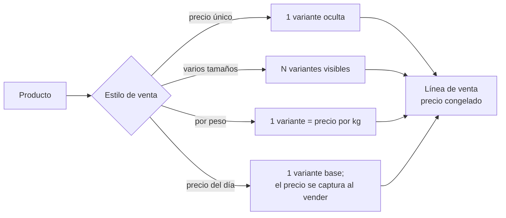

# 07 · El menú flexible

Un POS que impone su idea del menú obliga al restaurante a mentir en su catálogo:
media orden capturada como producto aparte, el pescado del día con precio inventado,
el kilo de camarón vendido "por pieza". Esas mentiras se pagan después, en los reportes.

Este sistema resuelve el problema con **cuatro estilos de venta** y **una sola forma
interna de leer un precio**.

---

## 1. Los cuatro estilos de venta

Cada producto elige uno. El mesero solo ve lo que ese producto necesita.

| Estilo | Cuándo se usa | Qué pasa en la venta |
|---|---|---|
| **Precio único** | Guacamole, refresco, cerveza | Se toca y se agrega |
| **Varios tamaños** | Orden / media orden, chico / mediano / grande | Se elige el tamaño y cada uno tiene su precio |
| **Por peso (kg)** | Mojarra, camarón por kilo | Se captura el peso en gramos; el precio es por kilo |
| **Precio del día** | Pescado del día, mariscada | Se captura el precio al momento de vender |

### La regla que lo sostiene

> **Todo producto tiene al menos una variante, incluso los de precio único.**

Un producto simple nace con una variante llamada "Único" que el mesero nunca ve. Gracias
a eso, las órdenes, las cuentas, los tickets y los reportes tienen **una sola ruta de
precio**, sea cual sea el estilo. Sin esa regla habría cuatro caminos distintos y cuatro
lugares donde equivocarse.

### Cambiar de estilo no destruye datos

Si un producto pasa de "varios tamaños" a "precio único", el sistema conserva el primer
precio y desactiva los demás tamaños en lugar de borrarlos. Los tickets viejos siguen
siendo verdad.

---

## 2. Modificadores reutilizables

Los grupos de modificadores no pertenecen a un producto: se definen una vez y se asignan
a los que los necesiten.

- **Término** (elige 1 de 1, obligatorio) → todos los filetes.
- **Sin ingrediente** (elige 0 a 4) → cocteles y ceviches.
- **Extras** (elige 0 a 3, con costo) → lo que sube el ticket.

El mínimo de selecciones es lo que convierte una preferencia en una regla: con mínimo 1,
el sistema no deja enviar el platillo hasta que el mesero pregunte el término.

---

## 3. El estilo visual también es configuración

Dos restaurantes con el mismo menú quieren pantallas distintas: uno con 12 productos y
fotos grandes, otro con 200 productos en lista compacta. En **Configuración → Estilo del
menú**, el dueño decide, y lo ve en vivo:

| Ajuste | Opciones | Para qué sirve |
|---|---|---|
| Presentación | Cuadrícula / Lista | Cuadrícula para menús cortos; lista para catálogos largos |
| Columnas | 2 / 3 / 4 | Se ajusta al tamaño real de la tablet |
| Tamaño de botones | Grandes / Cómodos | Grandes para dedos con prisa; cómodos para ver más de un vistazo |
| Mostrar precios | Sí / No | Algunos negocios no quieren precios en la pantalla de piso |
| Mostrar descripción | Sí / No | Útil cuando el mesero es nuevo |
| Color por categoría | Sí / No | El color acelera la búsqueda cuando ya se conoce el menú |
| Productos agotados | Apagados / Ocultos | Apagados evita que el mesero los busque; ocultos deja la pantalla limpia |

Ninguno de estos ajustes toca código ni requiere reiniciar nada.

---

## 4. Agotado del día

El botón más usado durante el servicio. Está en tres lugares —piso, cocina y
administración del menú— porque **el primero que sabe que se acabó el pulpo es quien
está en la cocina**, no el dueño.

Un producto agotado se ve pero no se puede vender (o se oculta, según la configuración).
Al día siguiente, "Reabrir agotados del día" lo devuelve todo a disponible de una vez.

---

## 5. Lo que este diseño evita

| Problema típico | Cómo se evita aquí |
|---|---|
| "Media orden" como producto separado | Es una variante del mismo producto: los reportes lo suman bien |
| Pescado del día con precio inventado | Estilo "precio del día": se captura al vender y queda congelado en la línea |
| Vender kilos como piezas | Estilo "por peso": la cantidad se guarda en milésimas (1.5 kg = 1500) |
| Subir un precio y descuadrar cuentas abiertas | El precio se congela en la línea al capturarla |
| Modificadores duplicados en 30 productos | Los grupos se definen una vez y se asignan |
